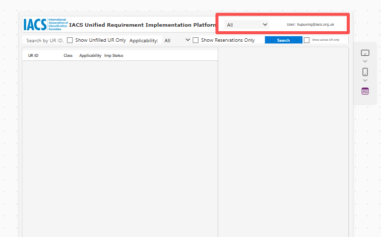

# 2. Access and Login

The URI Platform is built on Microsoft's Power Apps suite, backed by SharePoint List. 

### How to Access
1. Navigate to the URI Platform URL: `[Insert URL Here]`
2. You will be prompted to authenticate using your Microsoft 365 credentials, if you haven't logged in.
3. Upon successful login, your user ID and Society affiliation will appear in the top right corner of the application interface.

!!! note "Permissions"
    You will only be able to edit and update the UR Implementation Status for your respective classification society. All other societies' data will be visible in a read-only report to ensure transparency.

!!! Question 
    If you are not able to access the URI through the link on the IACS SharePoint Members' Area, please contact IACS Secretariat or IACS IT for help.

!!! Info
    The information in the Red Box is your afflicated society and user ID you signed in.