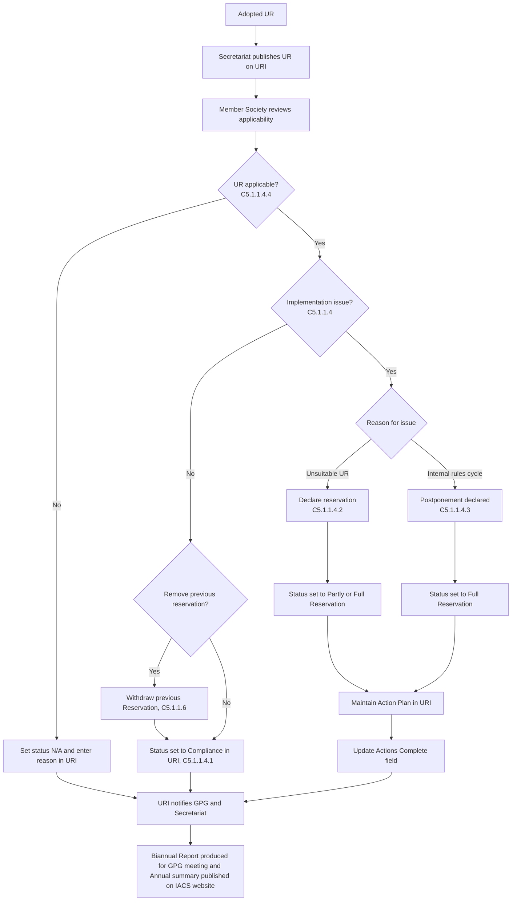

# Annex: Process Flowchart

This section provides a high-level visual representation of the lifecycle of a Unified Requirement (UR) within the URI Platform, tracking actions taken by both the Secretariat and individual Member Societies.

