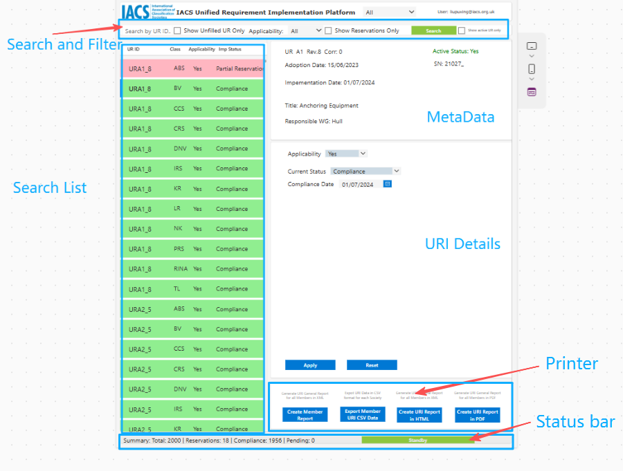

# 1. Introduction

Welcome to the **IACS Unified Requirement Implementation (URI) Platform User Manual**. 

The URI Platform replaces the legacy system of manual submissions via Forms X, Y, Z, and the consolidation Matrix.
It centralizes all required implementation information into a single source of truth, reducing inconsistencies and removing the administrative burden of redundant data entry.

!!! info "Management by Exception"
    The platform operates on a "Management by Exception" principle. For URs where an implementation path is still under internal review, the record may be left blank (unfilled). You only need to take formal action once a final decision is reached regarding Compliance, Reservation, or Applicability.

