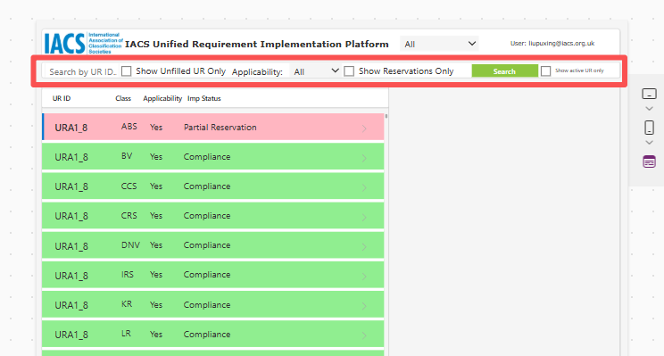
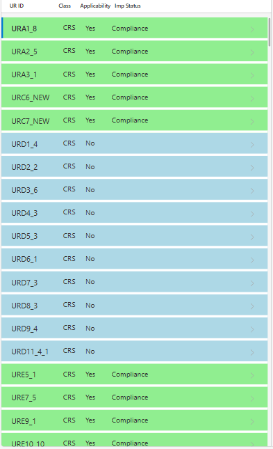
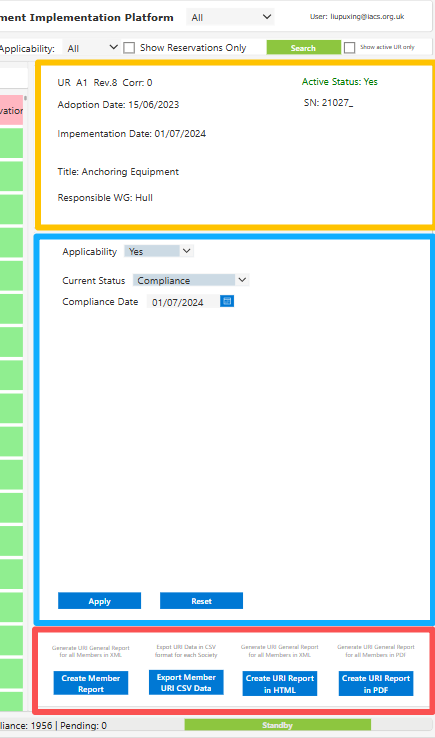

# 3. Query UR Implementation Status

The URI platform provides a robust filtering system allowing you to easily navigate the database of IACS Unified Requirements.

### Using the Search and Filter Bar

At the top of the interface, you can refine the visible URs in the left-hand list using the following controls:

* **Search by UR ID:** Type the specific ID (e.g., `URA1_8`) to instantly locate a record.
!!! Tip
    You need to include "UR" at the beginning for seaching a specific UR. You can't enter only "A1".
* **Show Unfilled UR Only (Checkbox):** Quickly filter the list to show only the URs that require your society's attention and have not yet been assigned a status.
* **Applicability (Dropdown):** Filter by `All`, `Yes`, or `No`.
* **Show Reservations Only (Checkbox):** Isolates the list to display only URs where a Partial or Full Reservation has been declared.
* **Show active UR Only (Checkbox):** Isolates the list to display only current or future version of URs.
!!! warning
    Some filters can't be applied at the same time. (e.g. unfilled and Show Reservation Only are contradictory)

### Understanding the Data List

The left pane displays the filtered list of URs, colour-coded for quick reference:

* **UR ID:** The reference number and revision.
* **Class:** The Member Society acronym.
* **Applicability:** Indicates if the UR applies to the society (Yes/No).
* **Imp Status:** Displays the current standing (e.g., Compliance, Partial Reservation).
* **Color Code:** Red for Reservation, Green for compliance, Blue for Non-applicable and Yellow for unfilled.

Selecting any row will populate the right-hand pane with the detailed UR metadata (Adoption Date, Implementation Date, Title, SN) and the status updating form.

### Understanding the URI Details

After you clicked a certain UR implementation record on the list, the right pane will display the URI details of a certain version of a UR to a certain society:

* **Metadata (Yellow Box):** UR's metadata, derived from IACS Publication Database.
* **URI form (Blue Box)** The detail of UR implementation status.
* **Printer (Red Box)** Showing the report export options.

