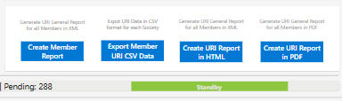

# 5. Report Printing

[cite_start]The URI Platform includes automated reporting engines to generate the necessary documentation for GPG meetings and internal reviews. 

At the bottom right of the interface, you will find four primary export options:

1. **Create Member Report:** Generates a URI General Report formatted specifically for your Member Society.
2. **Export Member URI CSV Data:** Downloads the raw data for your Society in a CSV format, allowing for external data manipulation or ingestion into other tools.
3. **Create URI Report in HTML:** Generates a web-friendly, comprehensive status report for all Members.
4. **Create URI Report in PDF:** Generates a finalized, static PDF document suitable for formal circulation and archiving for all Members.

!!! tip "Reporting Deadlines"
    Remember to ensure all data is validated and up-to-date before the Spring (March 1st) and Autumn (September 1st) reporting windows close.

!!! warning "Can't export report?"
    If a new TAB or window did not open, your browser's pop-up blocker intercepted it. Please check your browser address bar and try to click the ExportCSV button again.