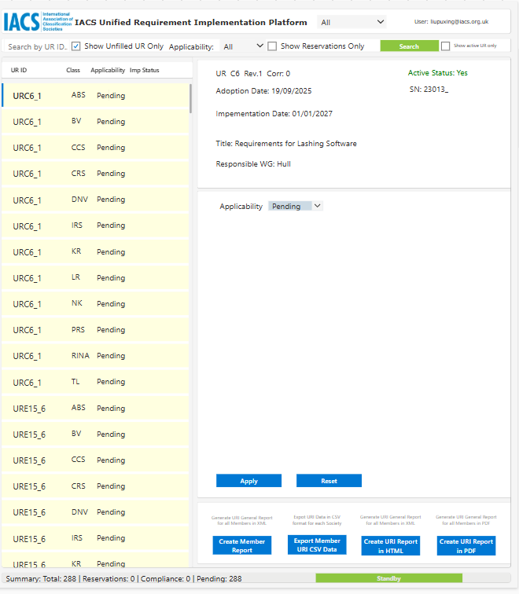

# 4. Update URI Status

!!! Note
    The required fields dynamically change based on the **Current Status** you select.

## Update unfilled UR Status

To update a UR from "unfilled" to a formalized status, select the target UR from the left-hand list. The right-hand pane contains the update form. for unfilled URI status, the **Applicability** is `Pending`.

### Status Definitions & Required Fields

=== "Compliance"
    Select **Compliance** when no UR reservation exists and the UR is formally incorporated into your Society's Rules.
    
    **Required Action:**
    
    * Set **Applicability** to `Yes`.
    * Set **Current Status** to `Compliance`.
    * Set **Compliance Date** to `Date of Compliance`.

=== "Partial / Full Reservation"
    Select **Partial Reservation** or **Full Reservation** if your Society finds certain aspects unsuitable or requires a delay due to internal rule cycles.
    
    **Required Action:**

    * Set **Applicability** to `Yes`.
    * Set **Current Status** to `Partial Reservation` or `Full Reservation`.
    * **Clause Ref:** Specify the exact paragraph/clause the reservation applies to.
    * **Expected Date:** The anticipated date of implementation.
    * **Reservation Detail:** Provide the technical reasons for the reservation.
    * **Proposed Action:** Detail the planned steps to remove the reservation.
    * **Action Complete:** Track progress as steps are finished.

=== "Not Applicable (N/A)"
    Select this if your Society chooses not to offer classification for the type of ship or maritime structure addressed by the UR.
    
    **Required Action:**
    
    * Set **Applicability** to `No`.
    * A new text field will appear requiring a **NA Reason (Reason for non-applicability)**. All other implementation fields will be hidden.

!!! tip "Using the Reset Button to Discard Changes"
    If you make a mistake, enter incorrect text, or change your mind while modifying fields in the detail form, click the **Reset** button located next to the Apply button. This will instantly wipe out your current unsaved edits and revert all fields back to their original, last-saved database state. 
    
    *Crucial Note:* This only works **before** you click the **Apply** button. Once **Apply** is clicked, the data is formally committed to the backend database.

!!! warning "Validation Check and System Log"
    Always click the **Apply** button at the bottom of the form and then **Yes** button to commit your changes to the database. The system will automatically record any changes to the URI database.

## Modifying Existing Records

As regulations evolve or internal rule cycles adjust, you will occasionally need to transition an item out of an already established status. The platform handles these changes dynamically based on the target status selected.

=== "Compliance ➔ Reservation"
    Use this workflow if your Society previously reported full compliance, but an un-foreseen internal rules cycle conflict or technical issue requires you to declare a postponement or an official reservation.
    
    **Steps to Execute Transition:**

    1. Locate and select the specific UR from the tracking list on the left pane.
    2. In the right-hand update form, change the **Current Status** dropdown from `Compliance` to either `Partial Reservation` or `Full Reservation`.
    3. The form will dynamically un-hide and require validation for the following fields:
        * **Clause Ref:** Input the exact paragraph or section numbers the reservation applies to.
        * **Expected Date:** The target coming-into-force date under your internal rules.
        * **Reservation Detail:** Provide the formal technical justification for the reservation.
        * **Proposed Action:** Input your Society's current action plan to eventually remove this reservation.
    4. Click the **Apply** button to save changes to the database.

=== "Reservation ➔ Compliance (Withdrawal)"
    Use this workflow when an outstanding URI reservation is successfully resolved.
    
    **Steps to Execute Transition:**

    1. Select the target UR currently marked as a reservation from the left pane. (Use filter or Search function to locate)
    2. Change the **Current Status** dropdown to `Compliance`.
    3. The platform will automatically adjust the form layout, hiding the action plan inputs and displaying the date picker.
    4. Enter the formal **Compliance Date** (the precise date the requirement was officially incorporated into your Society's Rules).
    5. Click the **Apply** button to finalize the update.
    
!!! tip "Using the Reset Button to Discard Changes"
    If you make a mistake, enter incorrect text, or change your mind while modifying fields in the detail form, click the **Reset** button located next to the Apply button. This will instantly wipe out your current unsaved edits and revert all fields back to their original, last-saved database state. 
    
    *Crucial Note:* This only works **before** you click the **Apply** button. Once **Apply** is clicked, the data is formally committed to the backend database.

!!! info "Automated System Actions"
    Upon clicking Apply, the URI platform will instantly clear the active reservation flag, log the formal withdrawal, and automatically broadcast an update notification to the Secretariat.
